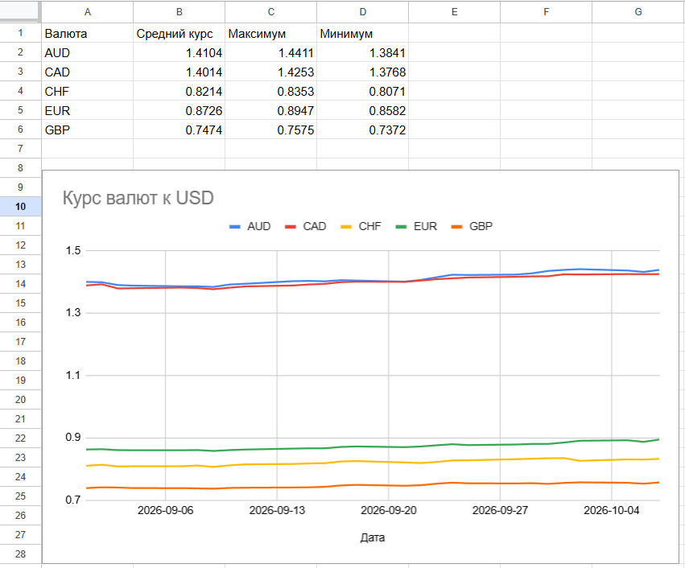
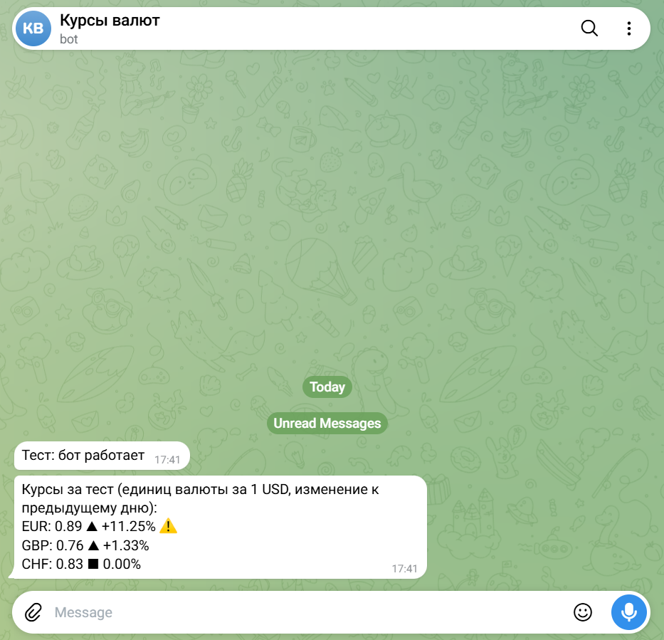

# Курсы валют: автообновление в Google Sheets

Google-таблица, которая сама собирает курсы валют к доллару США и каждый вечер присылает сводку в Telegram. Написана на Google Apps Script, без внешних серверов и платных сервисов.

**Демо-таблица (только просмотр):** https://docs.google.com/spreadsheets/d/1og0iwSwMwmePK_KeOtGtcoMRrQnQVDQ09n1dsVRzK3o/edit?usp=sharing

<p align="center">
  <br>
  <sub><b>Сводка и график в Google Sheets</b></sub>
</p>

<p align="center">
  <br>
  <sub><b>Вечерняя сводка в Telegram</b></sub>
</p>

## Что умеет

- Забирает курсы EUR, GBP, CHF, CAD и AUD к USD по REST API ([Frankfurter](https://frankfurter.dev), данные Европейского центрального банка).
- Хранит историю на листе `data` и не дублирует записи, если ЕЦБ в этот день ничего не опубликовал (выходные, праздники).
- Строит сводку (среднее, максимум, минимум) через `QUERY` и линейный график по всем валютам.
- Ежедневно отправляет в Telegram сводку с изменением курса к предыдущему дню и пометкой ⚠️, если изменение достигло порога (по умолчанию 2%).
- Содержит лист «Инструкция» для заказчика: что делает таблица, как изменить настройки, что делать при сбое.

## Как это работает

```
Frankfurter API (ЕЦБ)
        │  раз в сутки, триггер Apps Script
        ▼
   updateRates()  ──►  лист data (дата, валюта, курс)
        │                    │
        │                    ├─► лист graph_data (QUERY + pivot)  ──►  график
        │                    └─► лист Сводка (QUERY: avg / max / min)
        ▼
   sendDigest_()  ──►  Telegram Bot API  ──►  сообщение в чат
```

Листы:

| Лист | Назначение |
|---|---|
| Сводка | Среднее, максимум, минимум по каждой валюте и график |
| Инструкция | Описание для заказчика |
| graph_data | Вспомогательная таблица для графика (формула, не редактировать) |
| data | Сырые данные, их пишет скрипт |

## Установка

1. **Создайте таблицу** на [sheets.new](https://sheets.new). Листы `data` создаст скрипт, остальные добавьте вручную: «Сводка», «Инструкция», `graph_data`.
2. **Скопируйте код.** Расширения → Apps Script → вставьте содержимое `Code.gs` и сохраните.
3. **Создайте Telegram-бота.** В [@BotFather](https://t.me/BotFather): `/newbot`, получите токен.
4. **Узнайте chat_id.** Напишите своему боту `/start`, затем откройте в браузере `https://api.telegram.org/bot<ТОКЕН>/getUpdates` и найдите `"chat":{"id":...}`.
5. **Сохраните секреты.** Apps Script → Project Settings → Script Properties:
   - `TG_TOKEN`: токен бота
   - `TG_CHAT_ID`: ваш chat_id

   Токен не хранится ни в коде, ни в таблице.
6. **Проверьте бота.** Запустите функцию `testTelegram`. Первый запуск попросит разрешения для скрипта.
7. **Загрузите историю.** Запустите `backfill` один раз: она очистит лист `data` и загрузит курсы с 1 сентября 2026 (дату можно изменить в коде).
8. **Создайте триггер.** Триггеры (значок будильника) → Add Trigger → функция `updateRates`, Time-driven → Day timer → 5pm to 6pm. Триггер срабатывает после публикации курсов ЕЦБ (~16:00 CET), поэтому сообщение содержит данные текущего дня.
9. **Добавьте формулы.**

   Лист «Сводка», ячейка A1:
   ```
   =QUERY(data!A:C, "select B, avg(C), max(C), min(C) where B <> '' group by B label B 'Валюта', avg(C) 'Средний курс', max(C) 'Максимум', min(C) 'Минимум'", 1)
   ```

   Лист `graph_data`, ячейка A1:
   ```
   =QUERY(data!A:C, "select A, avg(C) where B <> '' group by A pivot B label A 'Дата'", 1)
   ```
   Затем выделите `graph_data` → Вставка → Диаграмма → Линейная. Если у таблицы другая локаль, разделитель аргументов может быть `;` вместо `,`.

## Настройка

В начале `Code.gs`:

```js
const CURRENCIES = ['EUR', 'GBP', 'CHF', 'CAD', 'AUD'];  // отслеживаемые валюты
const THRESHOLD = 0.02;                                   // порог пометки ⚠️ (2%)
```

Базовая валюта задаётся параметром `base=USD` в URL запросов. После смены списка валют перезапустите `backfill`.

## Функции

| Функция | Что делает |
|---|---|
| `backfill()` | Один раз вручную: очищает `data` и загружает историю |
| `updateRates()` | По триггеру: добавляет новый день и отправляет сводку |
| `sendDigest_()` | Считает изменение к предыдущему дню и формирует сообщение |
| `sendTelegram_()` | Отправляет текст через Telegram Bot API |
| `testTelegram()` | Проверка связи с ботом |
| `testDigest()` | Проверка формата сводки на тестовых данных (состояние восстанавливается) |

## Ограничения

- ЕЦБ публикует курсы около 16:00 по центральноевропейскому времени. Триггер срабатывает в 17:00–18:00, поэтому сообщение содержит актуальные данные текущего дня. В выходные и праздники новых данных нет, и сообщение не отправляется.
- Лимит Apps Script на время выполнения одного запуска и число запросов нам не мешает: скрипт делает один запрос к API и один к Telegram в сутки.
- Если у скрипта истекли разрешения, нужно один раз запустить любую функцию вручную и подтвердить доступ.

## Технологии

Google Apps Script (JavaScript), Google Sheets (`QUERY`, `pivot`), REST API (Frankfurter), Telegram Bot API.

## Автор

Георгий Эмеретли